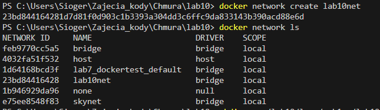
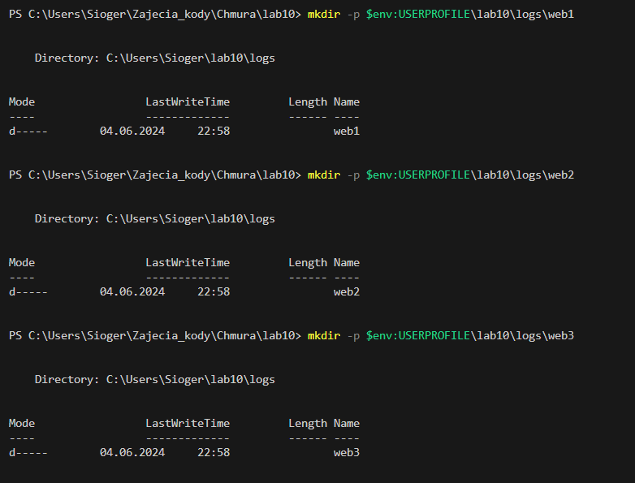
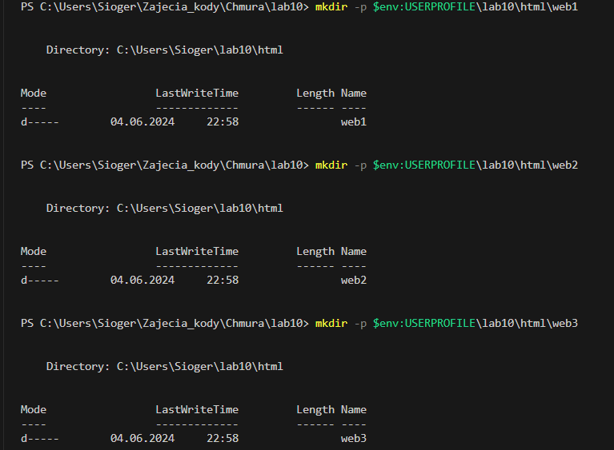
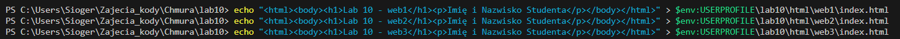
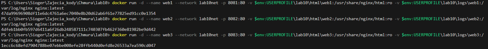
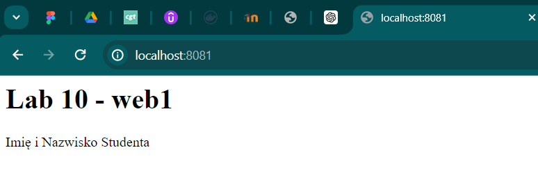
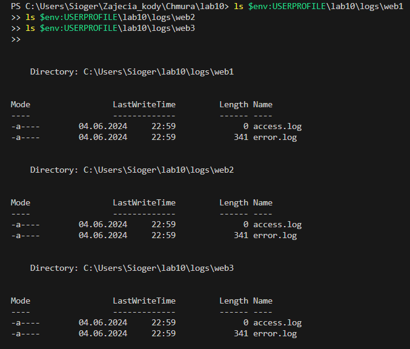

# Lab 10 - Docker Nginx Containers

## Wymagania

- System operacyjny: Windows 11
- Zainstalowany Docker Desktop

## Kroki do wykonania

### 1. Utworzenie sieci mostkowej

Najpierw uruchamiamy Wiersz polecenia albo w terminalu Visual studio Code i utwórzenie sieć mostkową o nazwie `lab10net`.

```cmd
docker network create lab10net
```



### 2. Przygotowanie katalogów i plików

Tworzymy katalog lab10 i stworzenie katalogów na logi i pliki dla każdego z serwerów:

```cmd
mkdir -p $env:USERPROFILE\lab10\logs\web1
mkdir -p $env:USERPROFILE\lab10\logs\web2
mkdir -p $env:USERPROFILE\lab10\logs\web3
mkdir -p $env:USERPROFILE\lab10\html\web1
mkdir -p $env:USERPROFILE\lab10\html\web2
mkdir -p $env:USERPROFILE\lab10\html\web3
```
Wynik:




Prosta strona HTML dla każdego serwera:

```cmd
echo "<html><body><h1>Lab 10 - web1</h1><p>Imię i Nazwisko Studenta</p></body></html>" > $env:USERPROFILE\lab10\html\web1\index.html
echo "<html><body><h1>Lab 10 - web2</h1><p>Imię i Nazwisko Studenta</p></body></html>" > $env:USERPROFILE\lab10\html\web2\index.html
echo "<html><body><h1>Lab 10 - web3</h1><p>Imię i Nazwisko Studenta</p></body></html>" > $env:USERPROFILE\lab10\html\web3\index.html
```
Wynik:


### 3. Uruchomienie kontenerów Nginx

```cmd
docker run -d --name web1 --network lab10net -p 8081:80 -v $env:USERPROFILE\lab10\html\web1:/usr/share/nginx/html:ro -v $env:USERPROFILE\lab10\logs\web1:/var/log/nginx nginx:latest
docker run -d --name web2 --network lab10net -p 8082:80 -v $env:USERPROFILE\lab10\html\web2:/usr/share/nginx/html:ro -v $env:USERPROFILE\lab10\logs\web2:/var/log/nginx nginx:latest
docker run -d --name web3 --network lab10net -p 8083:80 -v $env:USERPROFILE\lab10\html\web3:/usr/share/nginx/html:ro -v $env:USERPROFILE\lab10\logs\web3:/var/log/nginx nginx:latest
```
Wynik:



## 4. Sprawdzenie działania serwerów

Odwiedzenie na jednej z podanych stron w celu potwierdzenia działania serwerów:

- http://localhost:8081 dla web1
- http://localhost:8082 dla web2
- http://localhost:8083 dla web3

Wynik:


### 5. Sprawdzenie logów

```cmd
ls $env:USERPROFILE\lab10\logs\web1
ls $env:USERPROFILE\lab10\logs\web2
ls $env:USERPROFILE\lab10\logs\web3
```
Wynik:


